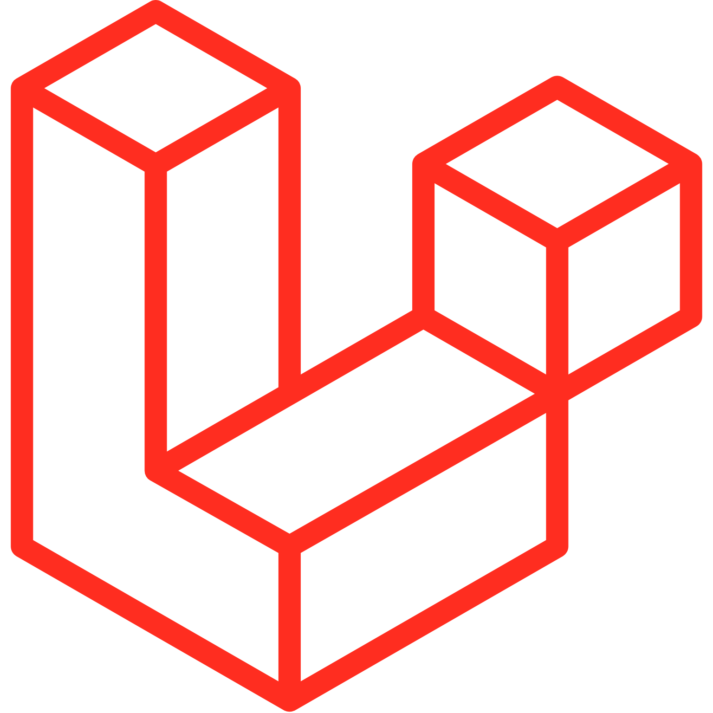

# 💫 About Me:

🗿 Full-stack developer with expertise in both back-end and front-end development. 🧑🏻‍💻 Proficient in Laravel, with experience in e-commerce, CRM systems, and tracking applications. 🧑🏻‍🚀 Exploring new technologies like Node.js and Next.js to expand my skill set. 🎨 Passionate about art and design, bringing creativity into my work. 🧠 Enjoy solving complex problems and building innovative solutions. 🫱🏻‍🫲🏼 Dedicated to continuous learning and sharing knowledge with others.

<h3 align="left">Connect with me:</h3>

    
    
    
    
    

 

 
<h1 align="left"># 💻 Tech Stack:</h1>

 
     
     
     
     
     
     
     
      
     
     
     
     
     
    <a href="https://getbootstrap.com" target="_blank" rel="noreferrer"> 
        <svg height="40" viewBox="0 0 512 407.864" width="40" xmlns="http://www.w3.org/2000/svg"><path d="m106.344 0c-29.214 0-50.831 25.57-49.863 53.3.929 26.641-.278 61.145-8.964 89.283-8.717 28.217-23.449 46.098-47.517 48.393v25.912c24.068 2.3 38.8 20.172 47.516 48.393 8.687 28.138 9.893 62.642 8.964 89.283-.968 27.726 20.649 53.3 49.868 53.3h299.347c29.214 0 50.827-25.57 49.859-53.3-.929-26.641.278-61.145 8.964-89.283 8.717-28.221 23.413-46.1 47.482-48.393v-25.912c-24.068-2.3-38.764-20.172-47.482-48.393-8.687-28.134-9.893-62.642-8.964-89.283.968-27.726-20.645-53.3-49.859-53.3h-299.355zm240.775 251.067c0 38.183-28.481 61.34-75.746 61.34h-80.458a8.678 8.678 0 0 1 -8.678-8.678v-199.593a8.678 8.678 0 0 1 8.678-8.678h80c39.411 0 65.276 21.348 65.276 54.124 0 23.005-17.4 43.6-39.567 47.208v1.2c30.176 3.31 50.495 24.21 50.495 53.077zm-84.519-128.1h-45.876v64.8h38.639c29.87 0 46.34-12.028 46.34-33.527-.003-20.148-14.163-31.273-39.103-31.273zm-45.876 90.511v71.411h47.564c31.1 0 47.573-12.479 47.573-35.931s-16.935-35.484-49.573-35.484h-45.564z" fill="#7952b3" fill-rule="evenodd"/></svg>
    </a> 
     
     
     
    <a href="https://www.photoshop.com/en" target="_blank" rel="noreferrer"> 
        <svg viewBox="0 0 240 234" xmlns="http://www.w3.org/2000/svg" width="40" height="40"><path d="M42.5 0h155C221 0 240 19 240 42.5v149c0 23.5-19 42.5-42.5 42.5h-155C19 234 0 215 0 191.5v-149C0 19 19 0 42.5 0z" fill="#001e36"/><g fill="#31a8ff"><path d="M54 164.1V61.2c0-.7.3-1.1 1-1.1 1.7 0 3.3 0 5.6-.1 2.4-.1 4.9-.1 7.6-.2s5.6-.1 8.7-.2 6.1-.1 9.1-.1c8.2 0 15 1 20.6 3.1 5 1.7 9.6 4.5 13.4 8.2 3.2 3.2 5.7 7.1 7.3 11.4 1.5 4.2 2.3 8.5 2.3 13 0 8.6-2 15.7-6 21.3s-9.6 9.8-16.1 12.2c-6.8 2.5-14.3 3.4-22.5 3.4-2.4 0-4 0-5-.1s-2.4-.1-4.3-.1V164c.1.7-.4 1.3-1.1 1.4H55.2c-.8 0-1.2-.4-1.2-1.3zm21.8-84.7V113c1.4.1 2.7.2 3.9.2H85c3.9 0 7.8-.6 11.5-1.8 3.2-.9 6-2.8 8.2-5.3 2.1-2.5 3.1-5.9 3.1-10.3.1-3.1-.7-6.2-2.3-8.9-1.7-2.6-4.1-4.6-7-5.7-3.7-1.5-7.7-2.1-11.8-2-2.6 0-4.9 0-6.8.1-2-.1-3.4 0-4.1.1zM192 106.9c-3-1.6-6.2-2.7-9.6-3.4-3.7-.8-7.4-1.3-11.2-1.3-2-.1-4.1.2-6 .7-1.3.3-2.4 1-3.1 2-.5.8-.8 1.8-.8 2.7s.4 1.8 1 2.6c.9 1.1 2.1 2 3.4 2.7 2.3 1.2 4.7 2.3 7.1 3.3 5.4 1.8 10.6 4.3 15.4 7.3 3.3 2.1 6 4.9 7.9 8.3 1.6 3.2 2.4 6.7 2.3 10.3.1 4.7-1.3 9.4-3.9 13.3-2.8 4-6.7 7.1-11.2 8.9-4.9 2.1-10.9 3.2-18.1 3.2-4.6 0-9.1-.4-13.6-1.3-3.5-.6-7-1.7-10.2-3.2-.7-.4-1.2-1.1-1.1-1.9v-17.4c0-.3.1-.7.4-.9s.6-.1.9.1c3.9 2.3 8 3.9 12.4 4.9 3.8 1 7.8 1.5 11.8 1.5 3.8 0 6.5-.5 8.3-1.4 1.6-.7 2.7-2.4 2.7-4.2 0-1.4-.8-2.7-2.4-4s-4.9-2.8-9.8-4.7c-5.1-1.8-9.8-4.2-14.2-7.2-3.1-2.2-5.7-5.1-7.6-8.5-1.6-3.2-2.4-6.7-2.3-10.2 0-4.3 1.2-8.4 3.4-12.1 2.5-4 6.2-7.2 10.5-9.2 4.7-2.4 10.6-3.5 17.7-3.5 4.1 0 8.3.3 12.4.9 3 .4 5.9 1.2 8.6 2.3.4.1.8.5 1 .9.1.4.2.8.2 1.2v16.3c0 .4-.2.8-.5 1-.9.2-1.4.2-1.8 0z"/></g></svg> 
    </a> 

# 📊 GitHub Stats:

## 🏆 GitHub Trophies

### ✍️ Random Dev Quote

---

<!-- Proudly created with GPRM ( https://gprm.itsvg.in ) -->
<picture>
  <source media="(prefers-color-scheme: dark)" srcset="https://raw.githubusercontent.com/tobiasmeyhoefer/tobiasmeyhoefer/output/github-snake-dark.svg" />
  <source media="(prefers-color-scheme: light)" srcset="https://raw.githubusercontent.com/tobiasmeyhoefer/tobiasmeyhoefer/output/github-snake.svg" />
  
</picture>
